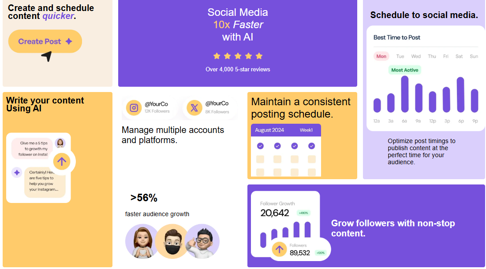

# 📊 Social Media Dashboard

A modern and responsive landing page showcasing social media growth insights and AI-powered content tools.

## 🚀 Live Demo
[Click here to view the app]

## 📸 Screenshot

## 🛠️ Built With
- HTML5
- CSS3 (Grid & Flexbox)
- Responsive Design (Mobile-first)

## ✨ Features
- Fully responsive layout
- CSS Grid complex layout system
- Clean and modern UI design
- Mobile-first workflow
- Interactive hover states

## 📚 What I Learned
- Advanced CSS Grid positioning
- Responsive design techniques
- Structuring complex layouts
- Improving UI consistency

## 👤 Author
- GitHub:https://github.com/Ceecee-ferdy

---

## 💡 Acknowledgements
Design inspired by frontend practice challenges.
